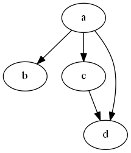
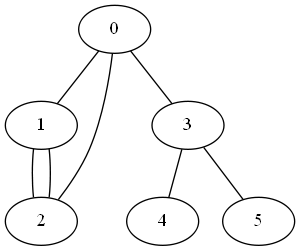
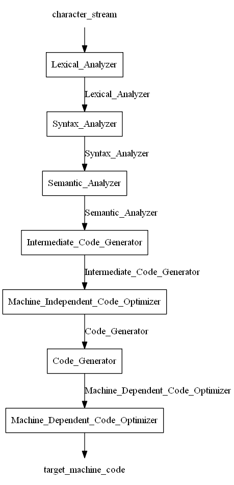
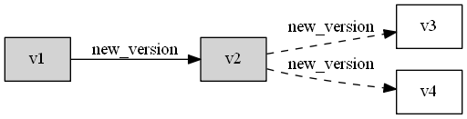
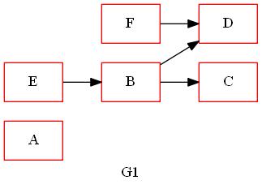
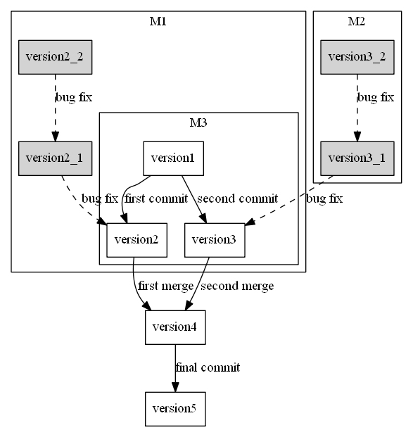

# Graphviz介紹
---
## DOT
- DOT語言是一種文字圖形描述語言
- 可以用來描述一張無向圖、有向圖等
- 針對Label屬性作設定，包含名稱、顏色、形狀等

## Graphviz 
- Graph Visualization Software的縮寫
- 由AT&T實驗室啟動的開源工具包，用於繪製DOT語言的命令行繪圖軟體
- 繪出的軟體較像是數學意義上的「graph」，也可稱作「關係圖」

## 安裝Graphviz 
到Graphviz網站中下載Windows的版本
[參考網址](http://www.graphviz.org/)
建置對應環境後即可用命令提示字元(cmd)編譯DOT檔案

## 撰寫DOT檔案
以下為一個有向圖的簡單範例

digraph G{
    a -> b
    a -> c
    c -> d
    a -> d
}

## 下指令跑出對應的圖形
無論是針對demo.dot或demo.txt都能輸出相同的圖形

```
$ dot -Tpng demo.dot -o demo.png 
$ dot -Tpng demo.txt -o demo.png
```



也可以生成類似下列圖形







## Resources
- [Graphviz官方網站](http://www.graphviz.org/)
- [DOT語言](https://zh.wikipedia.org/wiki/DOT%E8%AF%AD%E8%A8%80)
- [Graphviz](https://zh.wikipedia.org/wiki/Graphviz)
- [使用Graphviz繪圖](https://www.cnblogs.com/taceywong/p/5439574.html)
- [Graphviz－用指令來畫關係圖](https://www.netadmin.com.tw/netadmin/zh-tw/technology/122966CB664D4A17ABAAD11FC2AA887C?page=1)
- [DOT + graphviz 輕鬆畫圖神器](https://www.itread01.com/content/1549927837.html)